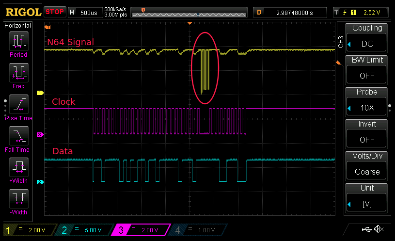

# Nintendo 64 interface design

The idea is to have a device that acts as a virtual Nintendo 64 controller when connected to a Nintendo 64 console.
Instead of having physical buttons and a joystick, it has an SPI "inspired" interface which can be connected to an Arduino or any other microcontroller. 

## N64 console

<u>**Protocol: Proprietary Nintendo 64 serial protocol.**</u>

Goal: To respond to commands from the Nintendo 64 console
Building on the great reverse-engineering done by Pieter-Jan and qwerty-modo (links below) I developed a bit-bashing implementation of the protocol in assembly on the ATtiny85.

http://www.qwertymodo.com/hardware-projects/n64/n64-controller
http://www.pieter-jan.com/node/10

The Nintendo 64 console sends commands to the controller, which can be polls for controller state and controller configuration (currently supported) or to read/write the controller's memory pack (currently not supported). 

Button and joystick states are polled for, by the console. The console polls the controller at roughly 25 Hz during normal gameplay (At least, as measured by me while playing Diddy Kong Racing). The console also periodically requests a status update from the controller, which the controller uses to indicate things such as whether there is a rumble pack or memory pack inserted.

During console startup and transition points in the game's program, these requests seem to speed up/slow down, leading to brief periods of much higher/random frequencies.

The interface is handled via interrupts written in inline assembly. Getting C variables in and out of an assembly routine is cryptic at the best of times, so for anyone trying to build on what I created refer to this guide to make interpreting it easier:
https://www.nongnu.org/avr-libc/user-manual/inline_asm.html

## Arduino / other microcontroller

**<u>Protocol: SPI "inspired" protocol, specifically designed to accommodate clock-stretching.</u>**

Goal: To provide a simple and reliable way to interface with the AVR n64 controller to set button and joystick states.

Not claiming it's a good implementation, but it's mine!

### Note: Why I didn't use serial

Initially I started using standard TTL serial. This worked, but not reliably.

Commands from the console are handled with interrupts, which can take up to ~160us to run. If a console command happens to co-incide with an asynchronous serial TTL transmission (as used by the standard Arduino Serial or SoftwareSerial libraries), this delay de-synchronises the sender and receiver, leading to corruption of the incoming packets.

I initially tried to work around this using a CTS (clear to send) I/O line. By assuming the 25Hz update frequency, I could time pulses of CTS to occur immediately after the command was processed. The reliability improved a bit, but was still far from iron-clad as at times the commands from the console would come faster than expected (for instance, during console start up) and still lead to corruption.

To solve this problem I moved to a synchronous protocol like SPI, which has a dedicated clock line.
The clock line is controlled by the ATtiny chip, so if required it can hold the clock in the current state while it services the N64 console command routine without interrupting the transmission of virtual controller status change requests from the external device.

Below is a capture from my test-bench, which shows an interrupted transmission.

You can clearly see how the clock line pauses while the ATtiny chip services a poll request from the N64 console. This pause can be detected by the sender (which controls the Data line, shown in blue above) so the participants can remain in sync and the data is not corrupted.

