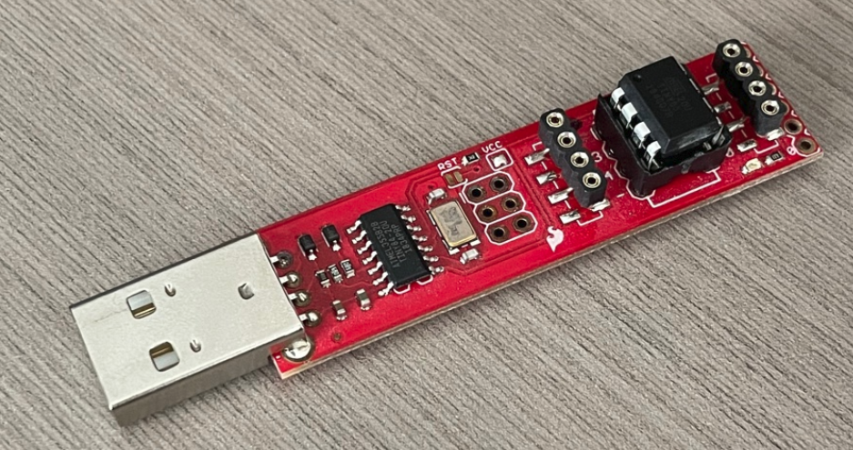

# ATtiny85 programming instructions

For this guide, I will be using the dedicated Tiny AVR Programmer, but you can use any supported method to flash the ATtiny85.



## Step 0: setup

Before following the instructions for setting fuses or uploading the program below, you need to ensure you have the following set up:

* An AVR programmer installed and set up on your PC.
  * For the Tiny AVR programmer, the Sparkfun hookup guide covers all of this so I will not repeat the instructions here.
    https://learn.sparkfun.com/tutorials/tiny-avr-programmer-hookup-guide
  * If you are one of those cool folks using Ubuntu/Linux, the process is slightly different. Refer to the excellent guide here:
    https://www.sigmdel.ca/michel/program/avr/sparkfun_tiny_programmer_en.html
* The Arduino IDE installed on your PC
* The ATtiny board installed in your Arduino IDE.

## Step 1: set fuses

Hook up your ATtiny to your programmer, and connect the programmer to your PC.

From the command line run the following command. This will confirm whether the ATtiny and the programmer are hooked up correctly.

```
~$ avrdude -c usbtiny -p attiny85
avrdude: AVR device initialized and ready to accept instructions
Reading | ################################################## | 100% 0.01s
avrdude: Device signature = 0x1e930b (probably t85)
avrdude: safemode: Fuses OK (E:FF, H:DF, L:62)
avrdude done.  Thank you.
```

We need to set the fuses of the ATtiny85 so it operates using the internal oscillator and does not divide the system clock by 8 - meaning it runs at 8MHz instead of 1MHz. To do this, run the below command:

```
~$ avrdude -c usbtiny -p attiny85 -U lfuse:w:0xE2:m -U hfuse:w:0xDF:m -U efuse:w:0xFF:m
avrdude: AVR device initialized and ready to accept instructions
...
... many lines later ...
...
avrdude: safemode: Fuses OK (E:FF, H:DF, L:E2)
avrdude done.  Thank you.
```

## Step 2: upload program

To compile and upload the firmware, use the Arduino IDE.

Open the `ATtiny85-n64-controller.ino` file in the Arduino IDE.

Select the board type as `ATtiny25/45/85` under `Tools -> Board -> ATtiny Microcontrollers.`

Select the processor as `ATtiny85` under `Tools -> Processor`.

Select the clock as `Internal 8MHz` under `Tools -> Clock`.

Select the programmer as `USBtinyISP` under `Tools -> Programmer`

With this done, compile and upload the program by pressing the upload button `(Ctrl+U)`

## Step 3: celebrate your victory

The ATtiny85 is now flashed and ready to be included in your circuit!


