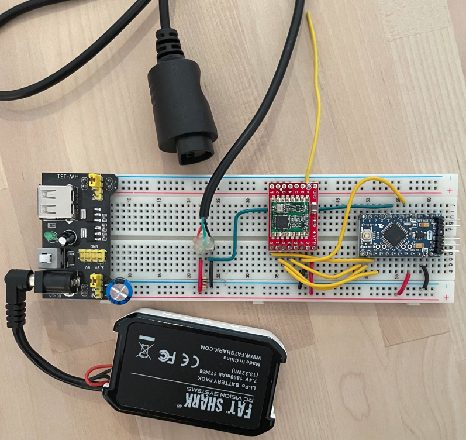
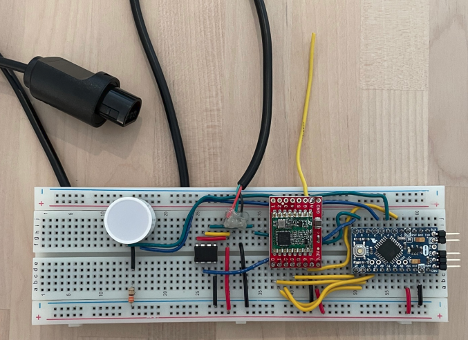

# Wireless Nintendo 64 Controller Project

## Overview

This page describes my project to make a Nintendo 64 controller wireless. 
You plug your favourite controller into the transmitter, then plug the receiver into the console.
There is currently no support for controller peripherals (e.g.: memory cards, rumble packs).

The system is built on Arduino/AVR and utilises the popular RFM69 radio modules for wireless communication.

## Hardware

### Transmitter

The transmitter (what you plug the controller into) consists of:

* 3.3V Arduino Pro Mini, the brains of the operation
* Sparkfun RFM69 Breakout, to enable wireless communication
* Breadboard, breadboard power supply and a power source (for portability, I used a 7.4V battery)
* Half a N64 controller extension cord (the end that connects to a controller)
* A 1K ohm resistor to pull the N64 signal line high.

### Receiver

The receiver (what you plug into the console) consists of:

* Another 3.3V Arduino Pro Mini
* Another Sparkfun RFM69 Breakout
* ATtiny85 dedicated to handling communication with the console
* Breadboard - no need for breadboard power supply as this board sources power from the console
* The other half of the N64 controller extension cord (the end that connects to the console)
* [Optional] - A bi-color LED indicator & resistor (this lights up when a button is pressed)

## Software

Transmitter software is located in the **wireless_n64_controller** sketch.
Flash **wireless_n64_controller.ino** to the Arduino Pro Mini on the transmitter.

Receiver software is located in the **wireless_n64_receiver** sketch.
Flash **wireless_n64_receiver.ino** to the Arduino Pro Mini on the receiver.
Flash **ATtiny85-n64-controller.ino** to the ATtiny85 on the receiver - refer to the "ATtiny85 programming instructions" document.

## Breadboard prototype set up

### Transmitter (Connect to controller)

### Receiver (Connect to console)

#### ATtiny85 pinout:

## Reference

The giants whose shoulders I stood on while building this:

http://www.pieter-jan.com/node/10

http://www.qwertymodo.com/hardware-projects/n64/n64-controller
